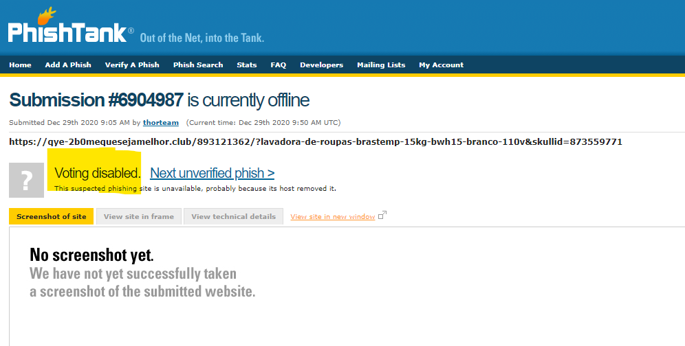

### This project crawl phishing URL's info from website: www.phishtank.com.

#### Requirement 1: Basic crawling:

- Expectations:

        1. Clear code.
        2. Know basic crawling principal.
        3. Know basic CSS selectors.

- Input: Base link: www.phishtank.com
- Output: CSV file with following fields:

        Id: xxxxxxx
        URL:
        Status:  ONLINE/offline
        Submitted date: Dec 29th 2020 8:02 AM
        Submitted by:  wagawaga
        Verified: 	VALID PHISH / Unknown

###### Test cases:

1. VALID PHISH: https://www.phishtank.com/phish_detail.php?phish_id=6904962
   

2. Not voted url: https://www.phishtank.com/phish_detail.php?phish_id=6905011
   

        =>  Verified = "Unknown"

3. Not voted url: https://www.phishtank.com/phish_detail.php?phish_id=6904987
   

         =>  Verified = "Unknown"  
4. Not a phish: https://www.phishtank.com/phish_detail.php?phish_id=6911119
   

         => Verified = "Benign"

#### Requirement 2: Python OOP:
    
- Expectations:
    
    1. Know how to write code in OOP principle.
    
- Resource: https://realpython.com/python3-object-oriented-programming/

- Task: Change crawl code to OOP code.